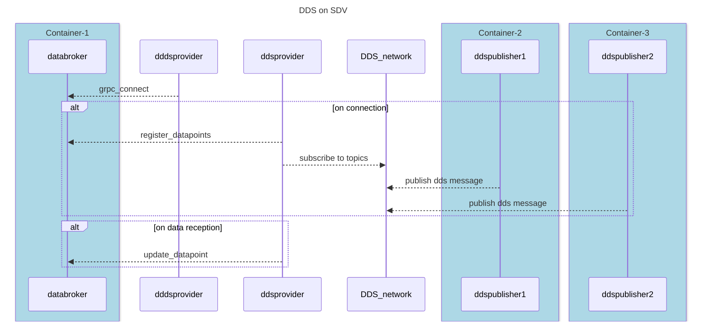

# DDS Provider

The DDS provider provides data from an DDS middleware/API. For further understanding of the DDS middleware/API see [this](https://www.dds-foundation.org/what-is-dds-3/). The DDS provider only works with the KUKSA databroker. The KUKSA C++ server is not supported.

## How to build

### local build

1. `python3 -m venv env && source env/bin/activate`
2. `pip install -r requirements.txt`
3. `chmod u+x ddsproviderlib/idls/generate_py_dataclass.sh`
4. `./ddsproviderlib/idls/generate_py_dataclass.sh`

### build image (suggested)

1. `docker build -f Dockerfile --progress=plain --build-arg TARGETPLATFORM=linux/amd64 -t ddsprovider:latest .`

### KML replay

1. `python3 -m venv env && source env/bin/activate`
2. `pip install -r requirements-kml.txt`
3. `cd kml && python3 dds_kmlreplay.py directions.kml`

## How to run

Choose from local build or contanerization via docker.
These steps are necessary:

1. Run an instance of databroker aka: `docker run -it --rm --net=host ghcr.io/eclipse/kuksa.val/databroker:master`
2. Start the KML replay with an active local python virtual environment (see [KML replay section](#kml-replay))
3. Start the DDS provider with either: `docker run --rm -it --net=host ddsprovider:latest` or with an active local python virtual environment: `python3 ddsprovider.py`

## Configure the DDS provider

Configuration for the DDS provider is solved through setting environment variables. Have a look at the table below.

| Environment variable          | default value | description                                                                                                                                      |
| ----------------------------- | ------------- | ------------------------------------------------------------------------------------------------------------------------------------------------ |
| VEHICLEDATABROKER_DAPR_APP_ID | None          | DAPR ID for Vehicle App to look for. For more information to Vehicle Apps visit [Velocitas](https://eclipse-velocitas.github.io/velocitas-docs/) |
| VDB_ADDRESS                   | 127.0.0.1     | Address where to look for (vehicle) databroker                                                                                                   |
| DAPR_GRPC_PORT                | None          | If [DAPR](https://dapr.io/) gets used port of DAPR Sidecar. Overwrites VDB_PORT variable                                                         |
| MAPPING_FILE                  | mapping.yml   | Place of mapping file from DDS to VSS                                                                                                            |
| VDB_PORT                      | 55555         | On which port the (vehicle) databroker is expected. If you want to use DAPR use DAPR_GRPC_PORT.                                                  |

## Overall sequence

## How to run the tests

1. create virtual python environment (`python3 -m venv testEnv && source testEnv/bin/activate && pip install -r requirements/requirements.txt requirements/requirements-test.txt requirements/requirements-kml.txt`)
2. terminal 2: `source testEnv/bin/activate && pytest --html=report.html --self-contained-html --cov=. tests/* --cov-report html --cov-report xml`
